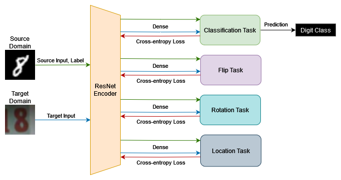
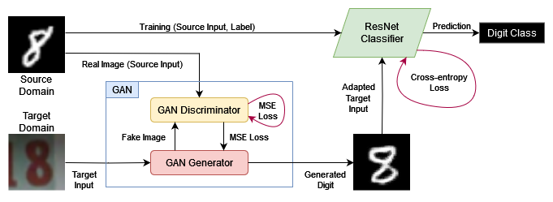

# Single Domain
Unsupervised Domain Adaptation by Target-to-Source Conversion

## Table of Contents
<!-- TOC -->
* [Introduction](#introduction)
* [Methods](#methods)
* [Results](#results)
* [Discussion](#discussion)
* [References](#references)
<!-- TOC -->

## Introduction
- In the rapidly evolving field of machine learning, the challenge of **Unsupervised Domain Adaptation** (UDA), whose goal is to leverage labeled data from the source domain to enhance performance on the target domain [1], [2], [3], [4], where labels are absent, remains a critical and complex problem.
- We propose a method for UDA using **Generative Adversarial Networks** (GAN), where we try to transform instances from the target domain to the source domain. After transforming our target domain into the source domain, we suggest utilizing a **standard classifier** (ResNet), trained only with source domain samples. Our proposed method aims to align our domains in a shared feature space with a similar distribution [2]. 
- We also provide a **baseline classifier** trained only on the source domain and tested on the target domain, as well as a **multitask method** without the use of GANs.

## Methods
The three following methods were developed and compared for Unsupervised Domain Adaptation:

- **Baseline**: A ResNet18 model which is trained on the source dataset and is used to predict both the source and target domain datasets.
- **Multitask**: This method includes a shared ResNet18 encoder that is used to represent the features of both the source and target domain. Several tasks are defined as separate pipelines of self-supervised tasks and a classification task, through which the two domains become aligned. These tasks include rotating the image, flipping the image horizontally and locating the position of a patch in the image. 
- **GAN ResNet**: A Generative Adversarial Network (GAN) is used to adapt the target domain’s image samples to the source domain. The adapted samples are then inputted to the ResNet18 model which classifies them. The ResNet18 model is trained only on the source domain dataset. The GAN model uses MSE loss and the ResNet18 model uses cross-entropy loss. Both use the Adam optimizer. 

## Results
The tables below showcase the accuracy of the three methods when applying Unsupervised Domain Adaptation between the MNIST and USPS datasets and the MNIST and SVNH datasets respectively:

| Method | MNIST | USPS | AVG | USPS | MNIST | AVG |
|--------|-------|------|-----|------|-------|-----|
|        |       |      |     |      |       |     |
|        |       |      |     |      |       |     |
|        |       |      |     |      |       |     |

| Method | MNIST | SVHN | AVG | SVHN | MNIST | AVG |
|--------|-------|------|-----|------|-------|-----|
|        |       |      |     |      |       |     |
|        |       |      |     |      |       |     |
|        |       |      |     |      |       |     |

## Discussion
...

## References
[1] Wang, J., Lan, C., Liu, C., Ouyang, Y., Qin, T., Lu, W., Chen, Y., Zeng, W., Yu, P.S.: Generalizing to Unseen Domains: A Survey on Domain Generalization.  
[2] Sun, Y., Tzeng, E., Darrell, T., Efros, A.A.: Unsupervised Domain Adaptation through Self-Supervision.  
[3] Xiao, L., Xu, J., Zhao, D., Wang, Z., Wang, L., Nie, Y., Dai, B.: Self-Supervised Domain Adaptation with Consistency Training. arXiv (Cornell University 2021).  
[4] Li, L., Gao, K., Cao, J., Huang, Z., Weng, Y., Mi, X., Yu, Z., Li, X., Xia, B.: Progressive Domain Expansion Network for Single Domain Generalization.  
