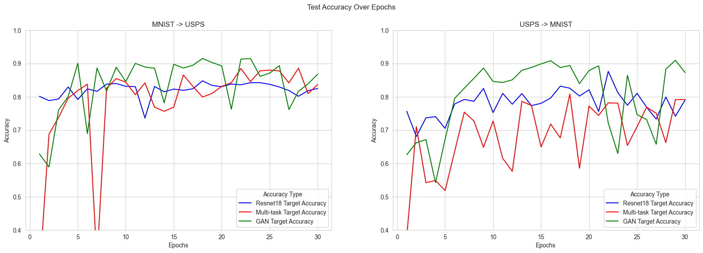
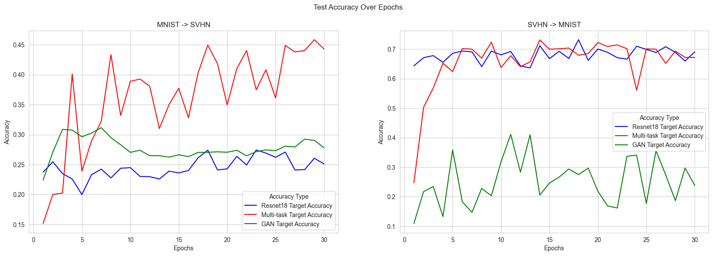

# Single Domain
Unsupervised Domain Adaptation by Target-to-Source Conversion

## Table of Contents
<!-- TOC -->
* [Introduction](#introduction)
* [Methods](#methods)
* [Results](#results)
* [Discussion](#discussion)
* [References](#references)
<!-- TOC -->

## Introduction
In the rapidly evolving field of machine learning, the challenge of Unsupervised Domain Adaptation (UDA), whose goal is to leverage labeled data from the source domain to enhance performance on the target domain [1], [2], [3], where labels are absent, remains a critical and complex problem.

We propose a method for UDA using Generative Adversarial Networks (GAN), where we try to transform instances from the target domain to the source domain. After transforming our target domain into the source domain, we suggest utilizing a standard classifier (ResNet), trained only with source domain samples. Our proposed method aims to align our domains in a shared feature space with a similar distribution [2]. 

We also provide a baseline classifier trained only on the source domain and tested on the target domain for comparison. Additionally, we use a MultiTask method without the use of GANs, which also aims to align both domains with the addition of self-supervised tasks.

## Methods
The three following methods were developed and compared for Unsupervised Domain Adaptation:

- **Baseline**: A ResNet18 model which is trained on the source dataset and is used to predict both the source and target domain datasets.
- **Multitask**: This method includes a shared ResNet18 encoder that is used to represent the features of both the source and target domain. Several tasks are defined as separate pipelines of self-supervised tasks and a classification task, through which the two domains become aligned. These tasks include rotating the image, flipping the image horizontally and locating the position of a patch in the image. 
- **GAN ResNet**: A Generative Adversarial Network (GAN) is used to adapt the target domain’s image samples to the source domain. The adapted samples are then inputted to the ResNet18 model which classifies them. The ResNet18 model is trained only on the source domain dataset. The GAN model uses MSE loss and the ResNet18 model uses cross-entropy loss. Both use the Adam optimizer. 

## Results
The two tables below showcase the accuracy of the three methods when applying Unsupervised Domain Adaptation between the MNIST and USPS datasets and the MNIST and SVNH datasets respectively:

| Method | MNIST | USPS | AVG | USPS | MNIST | AVG |
|--------|-------|------|-----|------|-------|-----|
| Baseline | 0.992 | 0.824 | 0.908 | 0.965 | 0.790 | 0.877 |
| MultiTask | 0.991 | 0.836 | 0.913 | **0.970** | 0.791 | 0.880 |
| GAN ResNet | **0.993** | **0.867** | **0.930** | 0.966 | **0.872** | **0.919** |

| Method | MNIST | SVHN | AVG | SVHN | MNIST | AVG |
|--------|-------|------|-----|------|-------|-----|
| Baseline | 0.988 | 0.250 | 0.619 | 0.878 | **0.690** | 0.784 |
| MultiTask | 0.987 | **0.442** | **0.714** | **0.924** | 0.671 | **0.797** |
| GAN ResNet | **0.989** | 0.278 | 0.634 | 0.790 | 0.238 | 0.514 |

The four following plots shows the progression of the test accuracy on the target domain over the duration of the training:

## Discussion
The GAN ResNet method provides a significant improvement in target accuracy for the MNIST and USPS datasets in both directions. It also slightly improves the accuracy in the MNIST → SVHN adaptation over the baseline classifier. However, it is significantly worse than even the baseline classifier in the SVHN → MNIST adaptation. We hypothesize this is due to the GAN failing to adapt the target domain to the source, as their distributions are too different.

The additional tasks added in the MultiTask method provide slightly better performance than the baseline classifier, but still worse than the GAN ResNet method, for the MNIST and USPS datasets in both directions. In the case of the MNIST → SVHN adaptation, the MultiTask method outperforms both the baseline and proposed methods by a large margin. It also massively outperforms the proposed method in the SVHN → MNIST adaptation, but still falls short of the baseline classifier.

## References
[1] Wang, J., Lan, C., Liu, C., Ouyang, Y., Qin, T., Lu, W., Chen, Y., Zeng, W., Yu, P.S.: Generalizing to Unseen Domains: A Survey on Domain Generalization.
[2] Sun, Y., Tzeng, E., Darrell, T., Efros, A.A.: Unsupervised Domain Adaptation through Self-Supervision.
[3] Li, L., Gao, K., Cao, J., Huang, Z., Weng, Y., Mi, X., Yu, Z., Li, X., Xia, B.: Progressive Domain Expansion Network for Single Domain Generalization.
